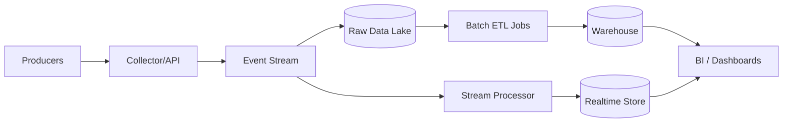

# Analytics Pipeline

## 1. Problem statement
Design an analytics pipeline that ingests events, stores them durably, and supports batch and near-real-time queries for metrics and dashboards.

## 2. Functional requirements
- Ingest events from many producers (web, mobile, backend).
- Validate and enrich events (schema, device, geo).
- Store raw events (immutable) and derived tables (aggregates).
- Support batch analytics and optional streaming dashboards.

## 3. Non-functional requirements
- Durable ingestion (no event loss under normal operation).
- Ability to replay data (for backfills).
- Cost-effective storage and compute.
- Data governance: access control and PII handling.

## 4. Assumptions
- 100k events/sec peak.
- Avg event size 1KB → ~100MB/sec raw.
- Retain raw events 1 year; aggregates longer.

## 5. High level architecture



## 6. API design
Collector:
`POST /v1/events`
```json
{
  "event_id": "uuid",
  "type": "page_view",
  "user_id": "u_1",
  "ts": "2026-03-04T12:00:00Z",
  "props": { "path": "/home" }
}
```

Response:
- `202 Accepted` if queued.
- Enforce payload limits and auth.

## 7. Data model
Raw events (data lake):
- Partition by `date` and optionally `event_type`.
- Store as Parquet/ORC for query efficiency.
- Schema evolution: versioned schemas, allow additive fields.

Warehouse tables:
- `fact_events(date, type, user_id, props...)`
- `agg_daily_metrics(date, metric_name, value)`

Realtime store (optional):
- Time-series DB or OLAP store optimized for dashboards.

## 8. Scaling strategy
- Collector is stateless; scale horizontally and buffer into stream.
- Stream partitions by key (e.g., user_id) to distribute load.
- Batch ETL uses incremental processing (daily partitions).
- Use compaction and retention policies to manage costs.

## 9. Bottlenecks
- Hot partitions (e.g., null user_id) → choose good partitioning key.
- Data quality issues (bad clients) → validation and quarantine topic.
- Backfills can be expensive → reprocessing infrastructure and cost controls.

## 10. Trade-offs
- Streaming gives freshness but increases operational complexity.
- Warehouse vs lakehouse: lake is cheaper for raw, warehouse is better for BI performance.
- Strict schema enforcement improves quality but may drop events; loose enforcement keeps data but increases downstream costs.

## 11. Possible improvements
- Data catalog + lineage tracking.
- PII tokenization and deletion workflows.
- Automated anomaly detection for key metrics.
- Self-serve query layer with caching.
