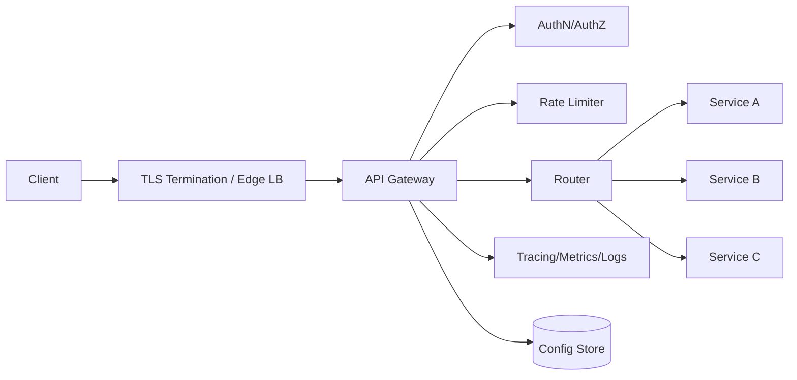

# API Gateway

## 1. Problem statement
Design an API Gateway that sits in front of multiple backend services, providing routing, authentication, rate limiting, and observability.

## 2. Functional requirements
- Route requests to upstream services (path/host based).
- Authenticate requests (JWT/OAuth2) and authorize basic access.
- Enforce rate limits and quotas.
- Request/response transformations (headers, tracing ids).
- Support canary releases / traffic splitting (optional).

## 3. Non-functional requirements
- Added latency p95 < 10ms for simple routes.
- Highly available (99.95%+).
- Secure defaults (TLS, WAF hooks, secrets management).
- High throughput (100k+ RPS depending on org).

## 4. Assumptions
- ~50 services behind the gateway.
- 10k RPS average, 50k RPS peak.
- Mix of REST and gRPC upstreams.

## 5. High level architecture



- Gateway instances are stateless; configuration is pulled from a config store and cached.
- Auth and rate limiting can be embedded middleware or external services depending on scale.

## 6. API design
Gateway is transparent externally; internal admin APIs are typical:

`POST /admin/routes`
```json
{
  "name": "orders",
  "match": { "path_prefix": "/v1/orders" },
  "upstream": { "host": "orders.svc", "port": 8080 },
  "timeouts_ms": { "connect": 200, "request": 2000 }
}
```

`POST /admin/policies`
```json
{ "route": "orders", "rate_limit": { "rps": 50, "burst": 100 } }
```

## 7. Data model
Config store (could be DB/etcd):
- `routes` (id, match rules, upstream target, timeouts, retries)
- `policies` (route_id, auth policy, rate limit policy)
- `certificates` references (if doing mTLS)

Use versioned configs:
- `config_version` to roll out atomically.
- Gateway caches config and supports hot reload.

## 8. Scaling strategy
- Horizontal scaling behind L4 load balancer.
- Keep gateway stateless; rely on shared stores only for config and optional global rate limits.
- Use connection pooling to upstreams.
- Use circuit breakers and bulkheads per upstream to avoid cascading failures.

## 9. Bottlenecks
- Heavy auth checks (JWKS fetch) → cache keys, rotate safely.
- Global rate limiting requires coordination (Redis) → adds latency.
- Large config pushes can cause thundering reloads → staggered rollout with versioning.

## 10. Trade-offs
- Centralized gateway simplifies clients but becomes a critical dependency.
- Transformations at gateway reduce duplication but can hide domain ownership issues.
- Global policies vs per-service: gateway is great for cross-cutting concerns, but business rules belong in services.

## 11. Possible improvements
- Plugin architecture for extensibility.
- mTLS between gateway and services.
- Built-in WAF rules and anomaly detection.
- Automated route discovery from service registry.
