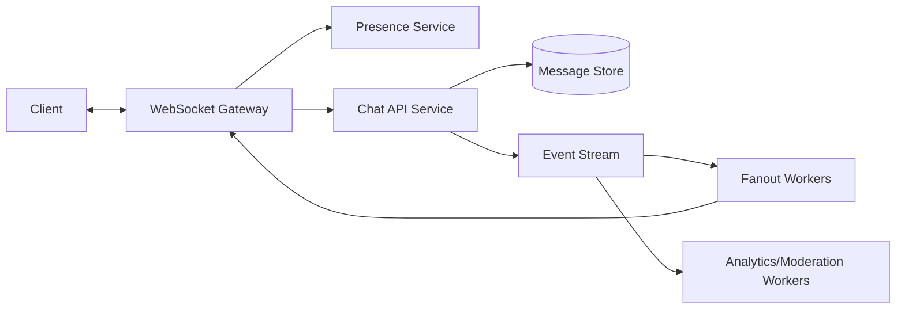
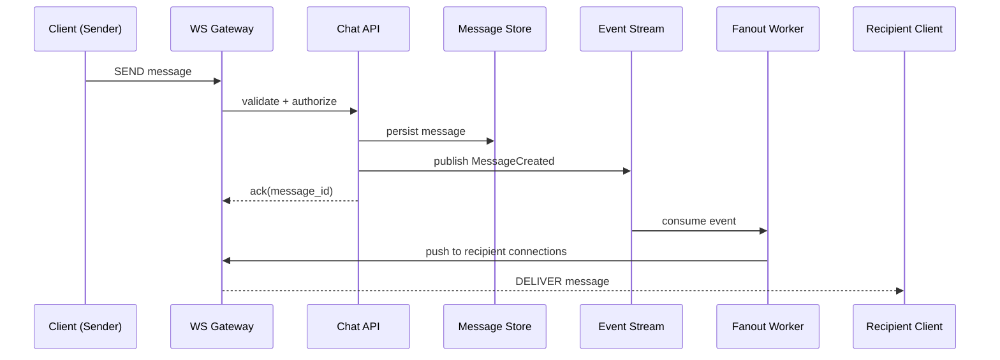

# Chat System (WebSockets + fanout)

## 1. Problem statement
Design a real-time chat system supporting 1:1 and small group conversations with low latency delivery and message history.

**Out of scope:** end-to-end encryption, advanced moderation, multi-device sync edge cases.

## 2. Functional requirements
- Users can send messages to a conversation.
- Online recipients receive messages in real-time.
- Store message history and allow pagination.
- Support read receipts (optional) and typing indicators (optional).

## 3. Non-functional requirements
- Message delivery latency p95 < 200ms (region-local).
- Availability 99.9%+.
- Durability for stored messages.
- Scalability to millions of concurrent connections.

## 4. Assumptions
- 500k daily active users.
- 50k concurrent WebSocket connections peak.
- Avg message size 1KB.
- 1:1 chats dominate; group size mostly < 50.

## 5. High level architecture



- Clients connect via WebSocket Gateway (sticky routing).
- Chat API persists messages and emits events.
- Fanout workers deliver to connected recipients and update unread counts.

### Message send sequence



## 6. API design

### Send message
`POST /v1/conversations/{id}/messages`
```json
{ "client_msg_id": "uuid", "text": "hello" }
```
Response:
```json
{ "message_id": "m_01H...", "created_at": "..." }
```
Idempotency: `client_msg_id` per conversation.

### Fetch history
`GET /v1/conversations/{id}/messages?before=<ts>&limit=50`

### WebSocket events
- `message.delivered`
- `presence.update`
- `typing.start/stop`

## 7. Data model

Table: `messages`
- `conversation_id` (PK part, partition key)
- `message_id` (PK part, time-sortable)
- `sender_id`
- `created_at`
- `payload` (text/attachments pointer)

Indexes:
- `(conversation_id, created_at desc)` for pagination.

Table: `conversation_members`
- `conversation_id`, `user_id`, `role`, `joined_at`

Presence (Redis):
- `presence:user:<id> -> {status, last_seen, connection_ids}` with TTL.

## 8. Scaling strategy
- WebSocket Gateway horizontally scales; use sticky sessions or a connection registry.
- Fanout:
  - For small rooms: push to each recipient connection.
  - For large rooms: hybrid approach (server-side “pull” or shard fanout).
- Partition message store by `conversation_id` to keep reads localized.
- Backpressure: per-connection queues with drop policy for non-critical events.

## 9. Bottlenecks
- Fanout cost for large groups (O(n) delivery).
- Hot conversations causing DB and stream hotspots.
- Presence flapping and frequent updates → coalesce updates, TTL-based presence.

## 10. Trade-offs
- Exactly-once delivery is expensive; prefer **at-least-once** with idempotent clients.
- Ordering:
  - Per-conversation order via time-sortable IDs.
  - Global order not required.
- Using a stream (Kafka) improves durability and replay but increases complexity.

## 11. Possible improvements
- Multi-region active-active with conversation affinity per region.
- Offline push notifications with device tokens.
- Attachments via separate file storage service.
- End-to-end encryption (key management, device sync).
