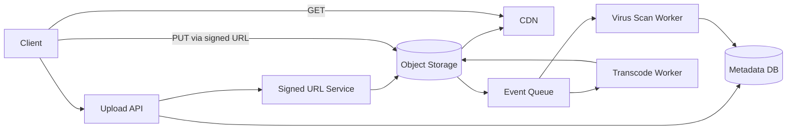

# File Storage System

## 1. Problem statement
Design a service for uploading, storing, and serving user files (images, documents) with metadata, access control, and efficient downloads.

## 2. Functional requirements
- Upload files (support multipart upload for large files).
- Download/serve files with authorization.
- Store metadata (owner, content type, size, checksum).
- Support deletion and retention policies.
- Optional: virus scanning and image transcoding.

## 3. Non-functional requirements
- High durability for blobs (11 9s style in cloud terms).
- Low latency downloads (use CDN).
- Support very large files (GBs).
- Secure access (signed URLs, ACLs).

## 4. Assumptions
- 1M uploads/day.
- Median file size 2MB; p99 1GB.
- Downloads are 10x uploads.
- 90 days retention for deleted files (soft delete).

## 5. High level architecture



## 6. API design

### Initiate upload
`POST /v1/files`
```json
{ "filename": "photo.jpg", "content_type": "image/jpeg", "size_bytes": 2048576, "checksum": "sha256:..." }
```
Response:
```json
{
  "file_id": "f_01H...",
  "upload_urls": ["https://object-store/...signed..."],
  "expires_in_sec": 900
}
```

### Complete upload
`POST /v1/files/{file_id}/complete`
```json
{ "parts": [{"part":1,"etag":"..."},{"part":2,"etag":"..."}] }
```

### Download
`GET /v1/files/{file_id}` → returns a signed download URL or streams the file.

## 7. Data model
Table: `files`
- `file_id` (PK)
- `owner_id`
- `bucket`
- `object_key`
- `content_type`
- `size_bytes`
- `checksum`
- `created_at`
- `deleted_at` (nullable)
- `scan_status` (pending/clean/quarantine)

Indexes:
- `(owner_id, created_at desc)` for listing.

## 8. Scaling strategy
- Store blobs in object storage; scale metadata DB separately.
- Serve downloads via CDN using cache-control and immutable object keys.
- Partition metadata by `owner_id` for large scale.
- Async processing for scanning/transcoding.

## 9. Bottlenecks
- Large file uploads: use multipart and direct-to-object-store to avoid API bandwidth bottleneck.
- Hot files: CDN caching; consider signed URL validation at edge.
- Metadata DB can become a hotspot for listing endpoints → pagination + indexes.

## 10. Trade-offs
- Direct-to-storage uploads reduce API load but require careful auth and completion workflow.
- Signed URLs improve performance but can complicate revocation; use short TTL and rotate keys.
- Strong consistency for metadata vs object store eventual consistency (depends on provider).

## 11. Possible improvements
- Content-addressed storage (dedupe by checksum).
- Per-file access policies and sharing links.
- Lifecycle policies (auto-tiering to cheaper storage).
- Regional replication for low-latency global access.
