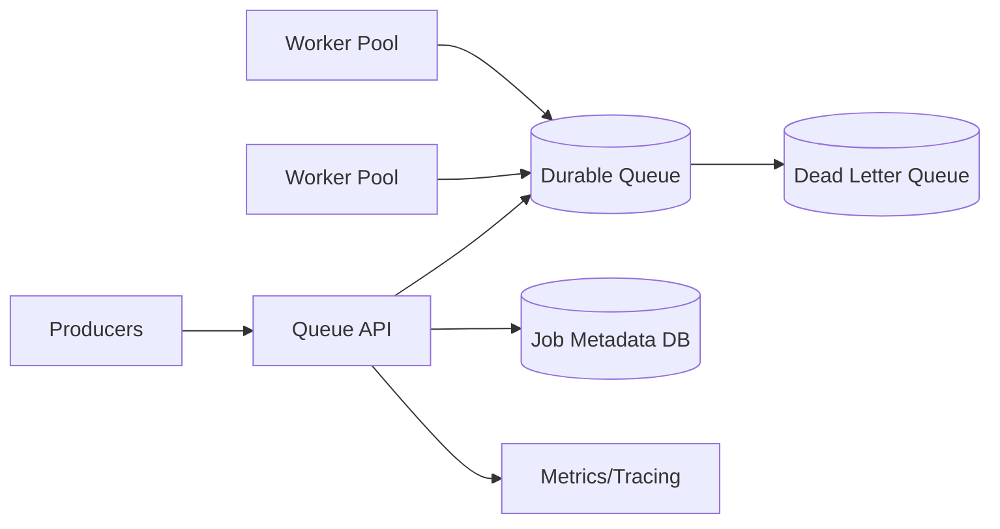
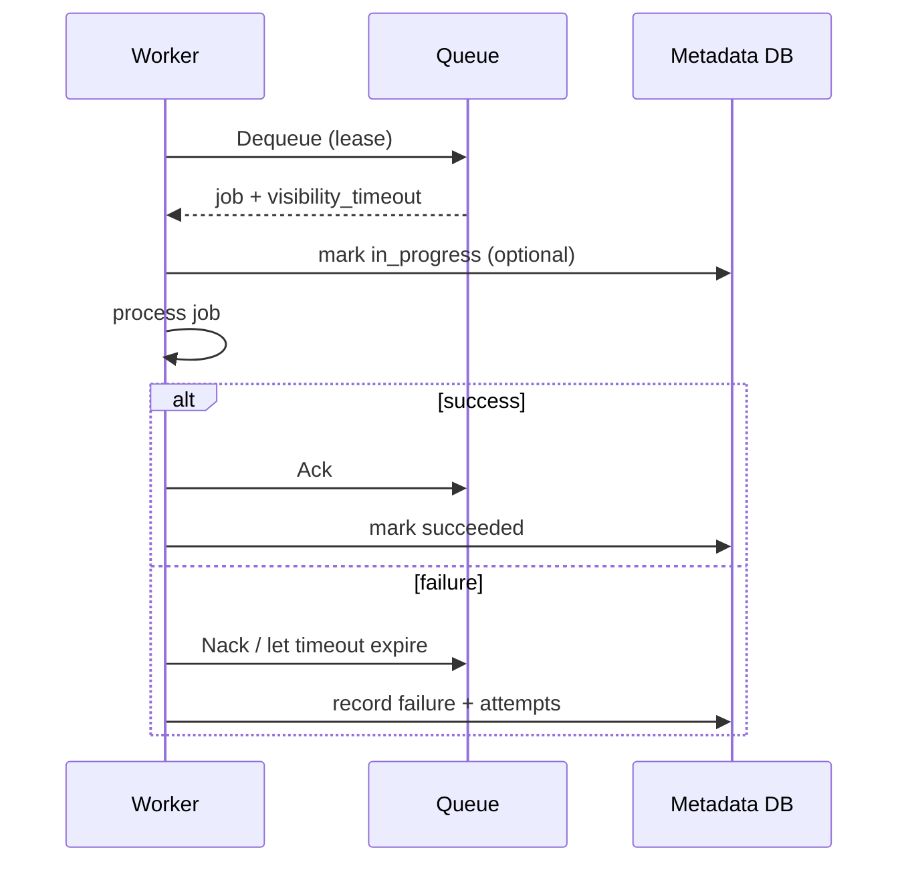

# Distributed Job Queue

## 1. Problem statement
Design a distributed job queue for background processing (emails, billing, media processing) with retries, scheduling, and visibility timeouts.

## 2. Functional requirements
- Enqueue jobs with payload.
- Workers can lease jobs, process, and ack.
- Support delayed/scheduled jobs.
- Retries with backoff; dead-letter queue for poison jobs.
- Provide basic monitoring: queue depth, job age, failure counts.

## 3. Non-functional requirements
- At-least-once processing semantics.
- High throughput (10k+ jobs/sec depending on usage).
- Avoid job loss (durable queue).
- Tenant isolation (optional).

## 4. Assumptions
- 5k enqueue/sec peak; 5k dequeue/sec peak.
- Job payload <= 32KB (large payloads stored externally).
- Typical processing time < 5 seconds, but long jobs exist.

## 5. High level architecture



### Worker lease sequence



## 6. API design
`POST /v1/jobs`
```json
{ "type": "send_email", "payload": { "to": "x@y.com" }, "run_at": "2026-03-05T12:00:00Z" }
```

`POST /v1/jobs/lease?worker_id=w1&limit=10`
Response:
```json
{
  "jobs": [
    { "job_id": "j_01H...", "type": "send_email", "payload_ref": "inline", "visibility_timeout_sec": 30 }
  ]
}
```

`POST /v1/jobs/{job_id}/ack`
`POST /v1/jobs/{job_id}/nack` (optional)

## 7. Data model
If using queue + metadata DB:
Table: `jobs`
- `job_id` (PK)
- `type`
- `payload_ref` (inline or blob pointer)
- `state` (queued/in_progress/succeeded/failed)
- `run_at`
- `attempts`
- `max_attempts`
- `last_error`
- `created_at`, `updated_at`

Queue structure:
- Ready queue (sorted by priority)
- Delayed queue (sorted by run_at)

## 8. Scaling strategy
- Partition queues by job type or tenant.
- Use visibility timeout + lease to handle worker crashes.
- Autoscale workers based on queue depth and oldest job age.
- Use idempotency keys per job to handle retries safely.

## 9. Bottlenecks
- Poison messages causing retry storms → DLQ + max attempts.
- Long-running jobs exceed visibility timeout → heartbeat/extend lease.
- Hot job types overload one shard → partition by type + consistent hashing.

## 10. Trade-offs
- Exactly-once is complex; prefer at-least-once with idempotent handlers.
- Queue-only vs queue+DB: DB adds visibility and queries but increases writes.
- Pull workers are simpler; push workers reduce polling but complicate backpressure.

## 11. Possible improvements
- Priority queues and per-tenant quotas.
- Workflow engine for DAG jobs.
- Cron scheduling support.
- Stronger observability and replay tooling.
