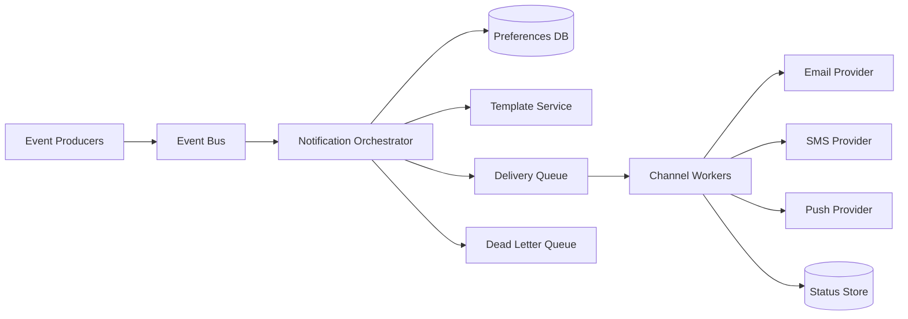

# Notification System

## 1. Problem statement
Design a notification system to deliver messages to users via multiple channels (email, SMS, push), with retries, idempotency, and user preferences.

## 2. Functional requirements
- Send notifications triggered by events (order shipped, password reset).
- Support multiple channels with fallback rules.
- Respect user preferences (opt-in/out, quiet hours, frequency caps).
- Provide delivery status tracking (sent, delivered, failed).

## 3. Non-functional requirements
- High reliability and auditability.
- Idempotent processing (avoid duplicate sends).
- Scalable fanout for campaigns.
- Security: protect PII and secrets (provider keys).

## 4. Assumptions
- 5k events/sec peak.
- Typical notification payload < 4KB.
- 3rd party provider APIs have rate limits and transient failures.

## 5. High level architecture



## 6. API design

### Trigger (internal)
`POST /v1/notify`
```json
{
  "idempotency_key": "evt_123",
  "user_id": "u_1",
  "template": "order_shipped",
  "channels": ["push", "email"],
  "data": { "order_id": "o_9" }
}
```

Response:
```json
{ "notification_id": "n_01H...", "accepted": true }
```

### Query status
`GET /v1/notifications/{id}`

## 7. Data model
Table: `notifications`
- `notification_id` (PK)
- `idempotency_key` (unique)
- `user_id`
- `template`
- `channels` (json)
- `created_at`
- `state` (pending/sent/failed)

Table: `notification_attempts`
- `notification_id` (PK part)
- `channel` (PK part)
- `attempt` (int)
- `provider_message_id`
- `status`
- `last_error`
- `updated_at`

Preferences:
- `user_id` (PK)
- `opt_in_email`, `opt_in_sms`, `opt_in_push`
- `quiet_hours` (json)
- `frequency_caps`

## 8. Scaling strategy
- Queue-based delivery with per-channel worker pools.
- Rate-limit per provider; apply backoff and jitter.
- Shard status store by `notification_id` if needed.
- For campaigns: generate recipient lists asynchronously and enqueue batches.

## 9. Bottlenecks
- Provider outages or rate limits → retries, fallback channels, DLQ.
- Duplicate sends due to retries → strict idempotency keys + provider-side dedupe if supported.
- Template rendering hotspots → cache compiled templates.

## 10. Trade-offs
- Strong ordering across channels is not necessary; prefer independent channel workflows.
- Synchronous send offers immediate feedback but hurts latency and reliability; async send is typical.
- “Exactly once” is impractical with external providers; aim for “effectively once” via idempotency.

## 11. Possible improvements
- Per-user notification digest (batching).
- Localization and A/B testing of templates.
- Deliverability monitoring and provider routing optimization.
- End-to-end tracing correlation for debugging.
