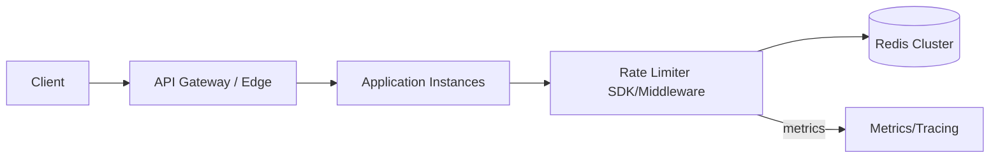

# Rate Limiter (Token Bucket + Redis)

## 1. Problem statement
Design a distributed rate limiter to enforce per-identity quotas (e.g., per API key, per user, per IP) across multiple stateless API instances.

We implement **Token Bucket** semantics with **Redis** for coordination.

## 2. Functional requirements
- Enforce limits: `N requests per T seconds` with bursts up to bucket capacity.
- Support multiple keys: API key, user ID, IP, route.
- Return remaining quota and reset time (optional).
- Provide fast decision: allow/deny per request.

## 3. Non-functional requirements
- Decision latency: p95 < 5–10ms (same region).
- Correctness: no significant over-limit due to concurrency.
- Availability: limiter should degrade gracefully (fail-open/closed policy per endpoint).
- Cost: avoid excessive Redis ops per request.

## 4. Assumptions
- 50k QPS across API fleet.
- 1M distinct identities/day (keys).
- Limits vary by plan (free/pro/enterprise).

## 5. High level architecture



Atomic bucket updates are executed via Redis Lua script.

## 6. API design

### Middleware interface (internal)
`checkLimit(key, capacity, refillRatePerSec) -> {allowed, remaining, retryAfterMs}`

If exposed as a service:
`POST /v1/ratelimit/check`
```json
{
  "key": "user:123|route:/v1/orders",
  "capacity": 100,
  "refill_per_sec": 1.0
}
```

Response:
```json
{ "allowed": true, "remaining": 42, "retry_after_ms": 0 }
```

## 7. Data model

Redis keys (per identity):
- `bucket:<key>` → hash:
  - `tokens` (float)
  - `last_refill_ms` (int)

TTL:
- Set TTL to ~2x window (or based on inactivity) to avoid unbounded growth.

Lua script (conceptual):
1. compute elapsed time
2. refill tokens = min(capacity, tokens + elapsed*refillRate)
3. if tokens >= 1 then tokens -= 1 allow else deny

## 8. Scaling strategy
- Redis Cluster with sharding by key hash.
- Use **pipelining** and reuse connections to reduce overhead.
- **Local in-memory cache** for “definitely under limit” with short TTL (optional) to reduce Redis load.
- Separate limiter policies per route; apply at gateway for best centralization.

## 9. Bottlenecks
- Redis becomes a central dependency → needs HA, monitoring, and capacity planning.
- Hot keys (single user spamming) can overload one shard → hash tags or additional key salt if needed.
- Clock skew across instances → use server time from Redis or store timestamps in Redis time units.

## 10. Trade-offs
- Token Bucket allows bursts, better UX; fixed window is simpler but bursty at boundaries.
- Centralized Redis gives correctness but adds dependency and latency.
- Fail-open (allow when Redis down) protects availability but can allow abuse; fail-closed protects resources but may impact customers.

## 11. Possible improvements
- Multi-region rate limiting using hierarchical approach (local + global).
- Sliding window log for strictness (higher cost).
- Weighted limits (cost per request) for expensive endpoints.
- Admin UI for dynamic policy updates and audit logs.
