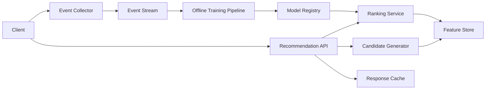

# Recommendation System

## 1. Problem statement
Design a recommendation system that suggests items to users (products, videos) with a balance of relevance, freshness, and diversity.

## 2. Functional requirements
- Generate personalized recommendations for a user.
- Support “similar items” recommendations.
- Support cold-start users/items.
- Collect feedback signals (clicks, likes, purchases).

## 3. Non-functional requirements
- Online inference latency p95 < 100ms.
- Resilient: fallback recommendations if ML services degrade.
- Observability for model performance and drift.
- Privacy: handle user data responsibly.

## 4. Assumptions
- 10M users, 1M items.
- 5k QPS rec requests peak.
- Feedback events: 50k/sec peak.

## 5. High level architecture



## 6. API design
`GET /v1/recommendations?user_id=u_1&limit=20&context=home`
Response:
```json
{
  "items": [
    { "item_id": "p_10", "score": 0.91, "reason": "because_you_viewed" }
  ]
}
```

Events:
`POST /v1/events`
```json
{ "type": "click", "user_id": "u_1", "item_id": "p_10", "ts": "..." }
```

## 7. Data model
Feature store (online):
- `user_features(user_id -> vector + aggregates)`
- `item_features(item_id -> vector + metadata)`
- `user_item_features(user_id,item_id -> counts, last_interaction)` (optional)

Training data (offline):
- Append-only event logs partitioned by date.
- Derived datasets for training and evaluation.

## 8. Scaling strategy
- Two-stage architecture:
  - Candidate generation (fast, approximate): ANN index, rules, popularity.
  - Ranking (slower, accurate): ML model on top candidates (e.g., 200 → 20).
- Cache responses for low-entropy contexts (home page) with short TTL.
- Precompute nightly “top recs” for many users if needed.

## 9. Bottlenecks
- Feature store read amplification (many features per request) → batch reads, co-locate, cache.
- Model hot path latency → optimize model size, use fast runtime, warm instances.
- Feedback loops and bias → need exploration and diversity constraints.

## 10. Trade-offs
- Accuracy vs latency: deeper models can be slower.
- Real-time updates vs batch freshness: streaming features improve recency but increase complexity.
- Personalization vs privacy: minimize sensitive features, apply retention rules.

## 11. Possible improvements
- Contextual bandits for exploration.
- Multi-objective ranking (relevance + diversity + fairness).
- Online learning for rapid adaptation.
- A/B testing platform integration.
