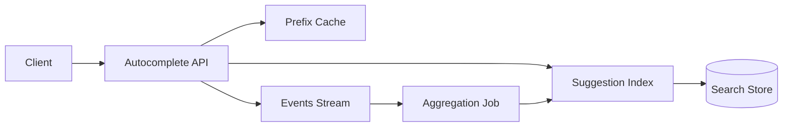

# Search Autocomplete

## 1. Problem statement
Design an autocomplete service that returns query suggestions as the user types, with low latency and relevance ranking.

## 2. Functional requirements
- Given a prefix, return top-K suggestions.
- Support typo tolerance (optional).
- Support per-locale suggestions (optional).
- Track popularity and decay over time.

## 3. Non-functional requirements
- Latency p95 < 50ms.
- High cache hit rate for popular prefixes.
- Freshness: new trending queries reflected within minutes (optional).

## 4. Assumptions
- 20k QPS peak.
- Prefix length 1–20 chars.
- Top prefixes are very hot (Zipf distribution).

## 5. High level architecture



- Index built from historical queries and catalog terms.
- Streaming aggregation updates popularity scores for near-real-time trending.

## 6. API design
`GET /v1/suggest?prefix=iph&limit=10&locale=en-US`
Response:
```json
{
  "prefix": "iph",
  "suggestions": [
    { "text": "iphone 15", "score": 0.98 },
    { "text": "iphone charger", "score": 0.83 }
  ]
}
```

Errors:
- `400` invalid prefix
- `429` rate limited

## 7. Data model
Index options:
- **Trie / Radix tree** stored in memory for fast prefix lookup.
- **Inverted index**: prefix → list of suggestions with scores.

Example KV model (Redis/RocksDB):
- Key: `p:<prefix>`
- Value: sorted list of (suggestion, score)
- TTL: none (rebuilt), or versioned snapshots.

Popularity store:
- `query_counts_daily(query, date, count)`

## 8. Scaling strategy
- Cache hot prefixes aggressively with short TTL and jitter.
- Shard by prefix hash if using distributed store.
- Use precomputed top-K suggestions per prefix to avoid runtime scoring.
- Use “edge cache” (CDN) for extremely hot prefixes (optional).

## 9. Bottlenecks
- Very hot prefixes (“a”, “i”) → require caching and request coalescing.
- Index rebuilds can be expensive → build new version and swap atomically.
- Ranking quality vs latency: advanced ML can be slow.

## 10. Trade-offs
- In-memory trie is extremely fast but needs memory and rebuild strategy.
- KV prefix lists are easy to distribute but can grow quickly for small prefixes.
- Typo tolerance adds complexity: consider separate fuzzy service or n-gram index.

## 11. Possible improvements
- Personalized suggestions using user embeddings.
- Context-aware suggestions (location, recent history).
- Better freshness with streaming updates to hot prefixes only.
