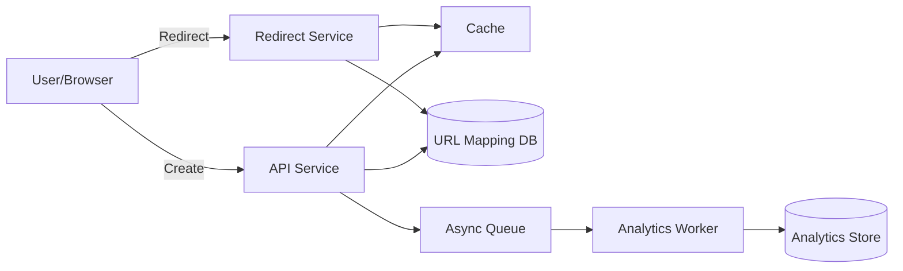

# URL Shortener

## 1. Problem statement
Design a service that converts long URLs into short links and redirects users to the original URL with low latency and high availability.

**Out of scope:** custom domains, deep link attribution, complex user management.

## 2. Functional requirements
- Create a short URL for a given long URL.
- Redirect short URL → long URL.
- Optional: basic link analytics (click count, last accessed time).
- Optional: link expiration (TTL).

## 3. Non-functional requirements
- Redirect latency: p95 < 50ms (region-local).
- Availability: 99.9%+ for redirects.
- Durable mapping storage (no losing links).
- Abuse protection (rate limits, malicious URLs).

## 4. Assumptions
- 5k QPS redirects peak, 200 QPS create peak.
- Avg long URL size ~ 1KB.
- 1 year retention for analytics aggregates.
- 100M total links (long-term).

## 5. High level architecture



**Notes**
- Split “create” and “redirect” paths to optimize redirect latency.
- Cache stores hot short→long mappings.
- Analytics are async to keep redirect fast.

## 6. API design

### Create short URL
`POST /v1/links`
```json
{
  "long_url": "https://example.com/some/very/long/path",
  "expire_at": "2026-12-31T00:00:00Z"
}
```
Response:
```json
{
  "code": "aZ3kLm9",
  "short_url": "https://sho.rt/aZ3kLm9"
}
```

Errors:
- `400` invalid URL
- `409` already exists (optional dedupe)
- `429` rate limited

### Redirect
`GET /{code}` → `302 Location: <long_url>`
- For expired links return `410 Gone`.

## 7. Data model

### URL mappings
Table: `links`
- `code` (PK, string) — short code
- `long_url` (string)
- `created_at` (timestamp)
- `expire_at` (timestamp nullable)
- `owner_id` (nullable, future)

Indexes:
- PK on `code`
- Optional unique index on `hash(long_url)` for dedupe

### Analytics (aggregates)
Table: `link_stats_daily`
- `code` (PK part)
- `date` (PK part)
- `clicks` (counter)
- `unique_visitors_est` (optional)

Retention: 1 year + rollups.

## 8. Scaling strategy
- **Cache-first redirect**: Redis/memcached keyed by `code` with TTL.
- **DB sharding** by `code` hash if dataset grows beyond single cluster.
- **Code generation**
  - Option A: base62 of random 7 chars (collision check).
  - Option B: Snowflake-like id → base62 (predictable but unique).
- **Async analytics** via queue (Kafka/SQS/RabbitMQ).

## 9. Bottlenecks
- Hot keys for popular links → cache and multi-get mitigation.
- Cache miss storms after eviction → request coalescing, TTL jitter.
- DB write amplification if doing per-click writes → keep clicks async/aggregated.

## 10. Trade-offs
- Random codes: harder to enumerate, but need collision handling.
- Predictable ids: simpler uniqueness, but easier enumeration (needs abuse controls).
- Strong consistency vs availability for create: redirects tolerate eventual propagation via cache warmup.

## 11. Possible improvements
- Custom aliases and custom domains.
- Malware/phishing detection pipeline.
- Geo-based redirects and richer analytics.
- Multi-region active-active with global routing.
