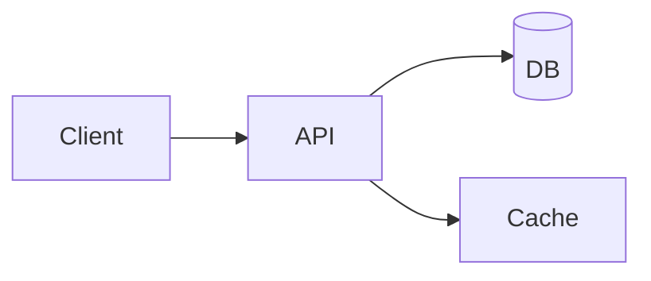

# <System Name>

## 1. Problem statement
Describe what we are building and (optionally) what is explicitly out-of-scope.

## 2. Functional requirements
- FR1
- FR2

## 3. Non-functional requirements
- Latency (p50/p95)
- Availability / Durability
- Consistency
- Security & privacy
- Cost constraints

## 4. Assumptions
Make assumptions explicit (traffic, data size, usage patterns). Use simple numbers.

## 5. High level architecture

Explain each component and the key flows (read/write, async jobs, failures).

## 6. API design
Define the external API contract(s). Include request/response examples and key error codes.

## 7. Data model
Tables/collections, keys, indexes, partition strategy, retention/TTL policies.

## 8. Scaling strategy
- Horizontal scaling approach
- Caching
- Partitioning / sharding
- Async pipelines
- Rate limiting / backpressure

## 9. Bottlenecks
Likely performance and reliability pain points. Include “why” and “symptoms”.

## 10. Trade-offs
Alternatives and decision rationale (simplicity vs cost, consistency vs availability, etc.).

## 11. Possible improvements
Future extensions: features, reliability, observability, cost optimizations.
